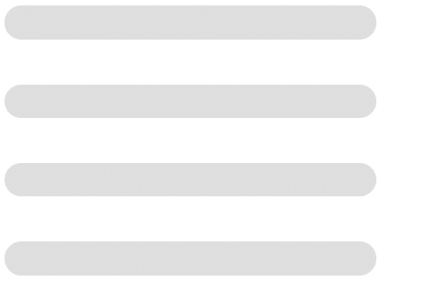

# Animated Loading Bar for Heyflow and Funnel Builders

This project provides a straightforward implementation of an animated loading bar using HTML, CSS, and JavaScript. The loading bar animates smoothly from 0% to 100%. This setup is ideal for using it on your website or for creating GIFs to be embedded in documentation, presentations, and especially in funnel builders like Heyflow to improve user experience and perceived value.

## Features

- **Smooth Animation:** Progresses from 0% to 100% in one second.
- **Customizable Design:** Easy to adjust colors and timing.
- **GIF Creation:** Simple steps to convert the animation into a GIF.
- **Enhanced User Experience:** Ideal for use in funnel builders like Heyflow to improve perceived value, as supported by this Harvard Business School [study](https://www.hbs.edu/faculty/Pages/item.aspx?num=40158).

## How It Works

The animation is created using CSS transitions and JavaScript for control. This ensures a smooth and visually appealing loading bar that can be recorded and converted into a GIF for various uses.

## Usage

### Setup

1. **Clone the repository:**
    ```sh
    git clone https://github.com/stefanerben/heyflow_animated-loader.git
    cd heyflow_animated-loader
    ```

2. **Open the `animations-generator.html` file:**
   - Use your preferred web browser to open the `animations-generator.html` file and see the loading bar animation.

### Recording the Animation

1. **Record the animation:**
   - Use a screen recording tool (e.g., OBS Studio, Camtasia) to capture the animation.

2. **Save the recording:**
   - Save the screen recording as a video file (e.g., MP4, AVI).

3. **Convert to GIF:**
   - Go to [ezgif.com](https://ezgif.com/) and upload your video file.
   - Use the site's tools to convert the video into a GIF.

### Embedding the GIF

Once you have created the GIF, you can embed it in your documentation, presentations, or any other platform that supports GIFs.

#### Example

Here’s an example of the result:



### Summary
By following the steps above, you can easily create a screen recording of the loading bar animation and convert it into a GIF using [ezgif.com](https://ezgif.com/). This GIF can then be embedded into your workflows or documentation to provide a visual representation of loading progress. This project is particularly useful for Heyflow and similar funnel builders to improve perceived value, as demonstrated in this Harvard Business School [study](https://www.hbs.edu/faculty/Pages/item.aspx?num=40158).
